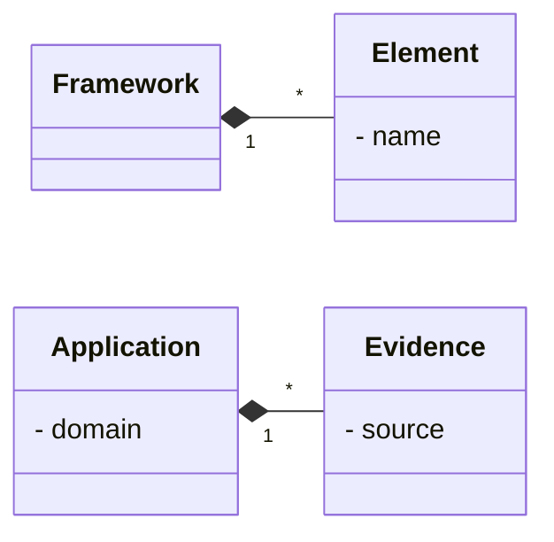

# Context Specification

The context specification documents the operational context of the system under development.
It summarizes the addressed problem, who has a stake in it, and what goals these stakeholders intend to achieve.
The specification aims to address the question *why* the system is worth developing.

## Project Scope

The systematic synthesis of quantitative evidence produced from empirical research requires a guiding framework. 
Frattini et al. proposed such a framework,[^1] but it is complex to understand and apply.
To improve the accessibility of the framework, there is the need for a visual demonstrator of the framework's application.

A full, dynamic platform is not required at this point, but a static snapshot of a potential application of the framework would already suffice to illustrate the point it is trying to make.

## Statkeholder Model

The following (groups of) users have a potential interest, i.e., stake, in the system:

- **Researchers** producing quantitative evidence from empirical research
- **Framework maintainers** (i.e., **maintainer**) proposing the evidence synthesis framework

> [!WARNING]
> These stakeholders have a stake in the static demonstrator. 
> The actual, dynamic system (that this system emulates) considers different stakeholders (e.g., practitioners who aim to retrieve synthesized evidence).

## Goal Model

The aforementioned stakeholders have the following goals.

### List of Goals

| ID | Stakeholder | Goal | Type |
|---|---|---|---|
| $G_1$ | Researcher | Access a visualization of the frameworks components | Usage |
| $G_{1.1}$ | Researcher | Obtain explanations of the elements of the framework | Usage |
| $G_{1.2}$ | Researcher | Obtain support in applying the process of the framework |
| $G_2$ | Researcher | Access a visualization of the frameworks application | Usage |
| $G_3$ | Maintainer | Receive feedback from the researchers | Usage |

As a static demonstator, the goals of the main stakeholder center around understanding the communicated concepts.

### Goal Relationships

The listed goals have the following supporting ($\overset{+}{\rightarrow}$) and blocking ($\overset{-}{\rightarrow}$) relationships among each other:

- $G_{1.1} \overset{+}{\rightarrow} G_2$ : a seamless integration between the framework explanation and its demonstation will mutually benefit each other.

## Domain Model

[^1]: Frattini, J., Fischbach, J., Fucci, D., Unterkalmsteiner, M., & Mendez, D. (2024). Replications, Revisions, and Reanalyses: Managing Variance Theories in Software Engineering. arXiv preprint [arXiv:2412.12634](https://arxiv.org/abs/2412.12634).