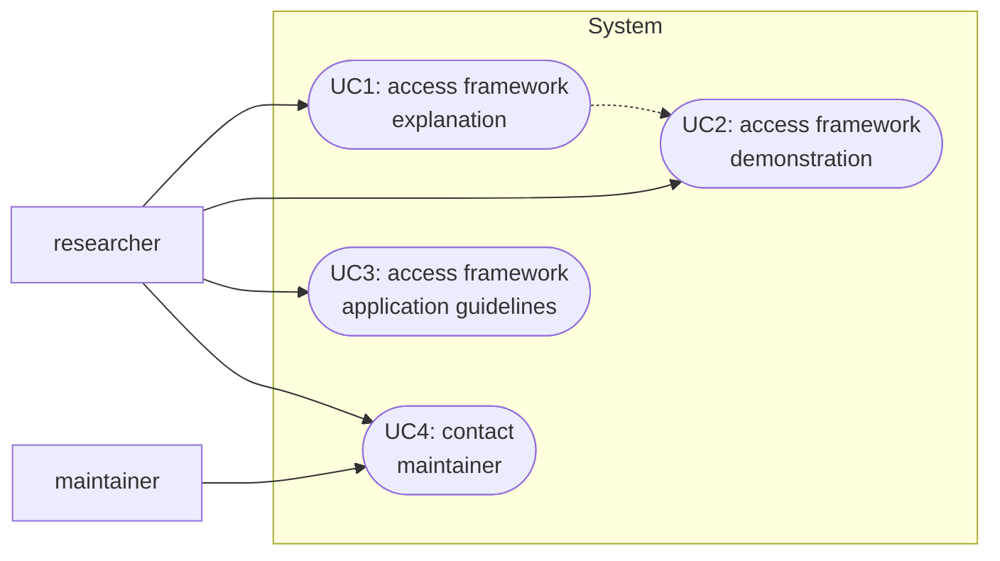

# Requirements Specification

The requirements specification documents the (functional and non-functional) needs and constraints that relevant stakeholders impose on the system under development to achieve their elicited goals.
This specification aims to answer *what* the system needs to be doing (without constraining *how* it will achieve it).

## System Vision

The following system vision visualizes the system under consideration, its main features (in form of use cases), the stakeholders that connect to it, as well as external features.

## Usage Model

The usage model specifies the functional requirements of the system.

### UC1: Access Framework Explanation

> As a researcher, I want to access detailed explanations of the components of the proposed framework so that I understand what the individual elements mean.

### UC2: Access Framework Demonstration

> As a researcher, I want to access a demonstration of the framework to get a visual illustration of how it can be applied in practice.

#### UC3: Access Framework Application Guideliens

> As a researcher, I want to access guidelines explaining how to apply the framework to understand how a researcher would utilize it.

#### UC4: Contact Maintainer

> As a researcher, I want to reach out to the maintainers of the framework to ask questions and propose changes.

> As a maintainer, I want to be informed by researchers reaching out to me to react to their requests.
